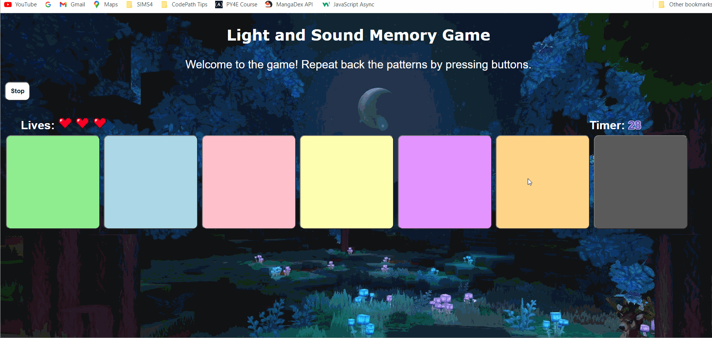
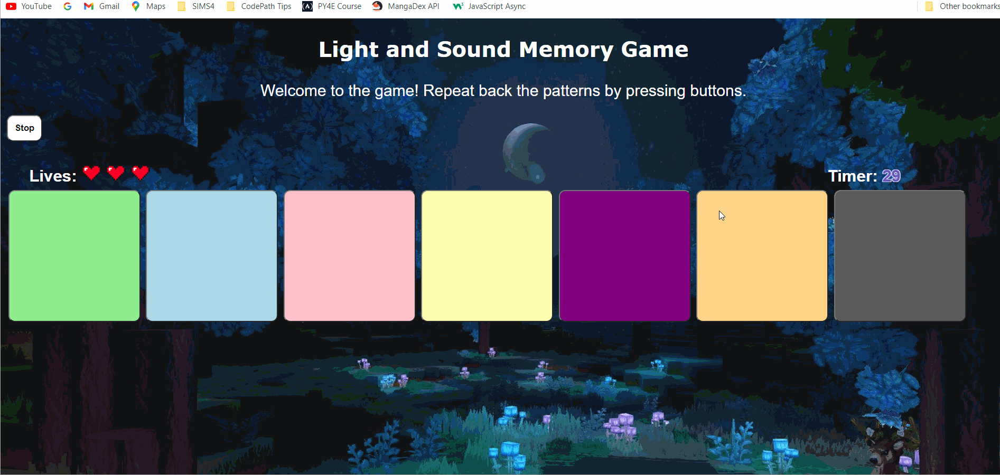

# Prework - _Light and Sound Memory Game_

# Pre-work - _Memory Game_

**Memory Game** is a Light & Sound Memory game for Salesforce’s Futureforce Tech Launchpad (FTL) internship.

Submitted by: **Christy Xiong**

Time spent: **59** hours spent in total

Link to project: https://glitch.com/edit/#!/stripe-respected-protest

## Required Functionality

The following **required** functionality is complete:

- [x] Game interface has a heading (h1 tag), a line of body text (p tag), and four buttons that match the demo app
- [x] "Start" button toggles between "Start" and "Stop" when clicked.
- [x] Game buttons each light up and play a sound when clicked.
- [x] Computer plays back sequence of clues including sound and visual cue for each button
- [x] Play progresses to the next turn (the user gets the next step in the pattern) after a correct guess.
- [x] User wins the game after guessing a complete pattern
- [x] User loses the game after an incorrect guess

The following **optional** features are implemented:

- [x] Any HTML page elements (including game buttons) has been styled differently than in the tutorial
- [x] Buttons use a pitch (frequency) other than the ones in the tutorial
- [x] More than 4 functional game buttons
- [x] Playback speeds up on each turn
- [x] Computer picks a different pattern each time the game is played
- [x] Player only loses after 3 mistakes (instead of on the first mistake)
- [x] Game button appearance change goes beyond color (e.g. add an image)
- [ ] Game button sound is more complex than a single tone (e.g. an audio file, a chord, a sequence of multiple tones)
- [x] User has a limited amount of time to enter their guess on each turn

The following **additional** features are implemented:

- [x] One of the patterns play the song, "Twinkle, Twinkle, Little Star."
- [x] Displays hearts for amount of turns left

## Video Walkthrough (GIF)

User Winning the Game:

User Losing the Game:

## Reflection Questions

1. If you used any outside resources to help complete your submission (websites, books, people, etc) list them here.

  - [mdn web docs](https://developer.mozilla.org/e-US/docs/web/javascript/reference/global_objects/math/random) - Math.random() Function
  - [mdn web docs](https://developer.mozilla.org/en-US/docs/Web/API/setInterval) - startInterval functionality
  - [Frequencies for Sounds](https://mrs-o-c.com/Finch/soundFrequencies.html) - Twinkle, Twinkle, Little Star Frequencies 
  - [mica-web](https://mica-web.github.io/learn/workflows/add-img-glitch) - Add image to background
  - [w3schools](https://www.w3schools.com/css/css_text.asp) - Changing font color
  - [wikihow](https://www.wikihow.com/Change-the-Button-Color-in-HTML) - Changing font to bold
    
2. What was a challenge you encountered in creating this submission (be specific)? How did you overcome it? (recommended 200 - 400 words)

   I encountered a few problems when I was trying to implement the optional features. One of the problems that I encountered was when I tried to implement the 5th optional feature, Spruce up your buttons. I wanted to include an image of a star inside the buttons because initially my game played the “Twinkle, Twinkle, Little Star” song as its pattern. Once I found the desired image, I added the image inside the HTML page. This step was a bit tricky, initially, since I was not sure of where to place the image. I tried placing the image throughout different areas within the HTML code, and through trial and error, I figured out that if we place the image where each button is located, then the image will display inside the button. Additionally, the most challenging part of this feature was to hide the images until the user clicks on the appropriate button. My initial impulse was to utilize Google search as a source to figure out how others tried to solve this problem. During this time, I spent approximately 2 to 3 hours searching on Google trying to implement the method for this feature, but to no avail. I decided to take a break from this project in hopes of returning with a different solution and a refreshed brain. A few days later, I worked on this project again but in this scenario, I decided to look at the prework guide to learn more information about the hidden class. Since we hid the Start and Stop button by using the hidden class, I reread the information about it. I found out that to hide an element, we must include the syntax **class=” hidden”** into the image section. Once this was done, the images for each button successfully disappeared. Now, I analyzed the index.html code because we only want to have the image display whenever the user is clicking on the appropriate button. Therefore, I saw that when the user clicks down and up on the mouse, the **startTone(btn)** and **stopTone()** methods are called. Afterwards, I went inside the JavaScript file to look at how we hid the Start and Stop buttons. After analyzing the code, I created a line of code called **document.getElementById("star"+btn).classList.add("hidden");** and included it inside the **stopTone()**. However, since we need to know the value of the button currently being clicked, I changed the **stopTone()** method to **stopTone(btn)**. The results of this change will hide the image after the user stops clicking on a button. Afterwards, I added a similar line of code called **document.getElementById("star"+btn).classList.remove("hidden");**, which will display the image when the user clicks on the button. However, I needed to create an if statement because we only want the image to display when the user clicks on the correct button. Hence, I included this statement to the end of the **startTone(btn)** method.

   **if (btn == pattern[guessCounter])**

   **document.getElementById("star"+btn).classList.remove("hidden");**

   **}**

   The result of this change in code will allow the user to display an image of the correct button.
   Although this challenge was quite difficult to begin with, I believe that the solution that assisted me the most in solving this problem was taking a step back and solving the problem from a different angle. At first, my initial instance was to try and find a solution on Google to solve this problem. However, once I took a break from the project and decided to tackle the problem by reviewing the prework guide, I successfully solved the problem.

3. What questions about web development do you have after completing your submission? (recommended 100 - 300 words)

   After completing my submission, I had a question regarding how web developers maintain websites with many users visiting it all at once. For example, one of the websites I love using is YouTube. YouTube is a global platform with about 122 million users visiting it every day. There were experiences I have seen in the past where websites have crashed because too many users were visiting it all at once. Because YouTube and many other big platforms have an extremely large amount of people visiting it daily, how do the web developers ensure that each user does not experience crashing, and what are some steps to consider in finding a solution to the problem when the website does crash?

   Also, I have questions regarding to creativity in web development. When I was modifying my prework for this submission, I really enjoyed designing and showing my own creativity through the project by utilizing basic techniques such as the Math.random() function. At higher levels of coding, how are web developers able to use complex techniques on big projects while still continuing to fulfil some creative aspects from coding?

4. If you had a few more hours to work on this project, what would you spend them doing (for example: refactoring certain functions, adding additional features, etc). Be specific. (recommended 100 - 300 words)

   If I had a few more hours to work on this project, I would love to fix my timer in the Light and Sound Game. The reason being is because my timer starts right when the sound starts playing, and I want the timer to start after the sound pattern has been played. I have looked at many functions that can help me fix this issue, however due to limited time and my lack of experience in javascript, css, and HTML, I did not have enough time to finish my goal. I do plan to set some time aside when I have the time to try and fix this issue. Some functions that I looked at includes the async, await, and promise functions. I did try utilizing the setTimeout function to solve this problem, but the issue was the same. Another goal that I wanted to include into my project was to have a Minecraft themed game, where the buttons would have Minecraft animals on them instead of stars, and to change the audio to the sounds of each animal. However, if I wanted to implement these features, I concluded that I would have to learn more about the audio features and resizing of images in JavaScript and HTML. Therefore, if I had a few more hours to work on this project, I would have spent them on fixing my timer and designing a Minecraft themed game. 

## Interview Recording URL Link

[My 5-minute Interview Recording](https://youtu.be/g2wAl_uGOpA)

## License

    Copyright [Christy Xiong]

    Licensed under the Apache License, Version 2.0 (the "License");
    you may not use this file except in compliance with the License.
    You may obtain a copy of the License at

        http://www.apache.org/licenses/LICENSE-2.0

    Unless required by applicable law or agreed to in writing, software
    distributed under the License is distributed on an "AS IS" BASIS,
    WITHOUT WARRANTIES OR CONDITIONS OF ANY KIND, either express or implied.
    See the License for the specific language governing permissions and
    limitations under the License.
